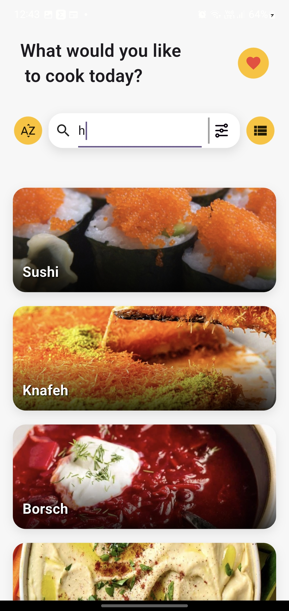
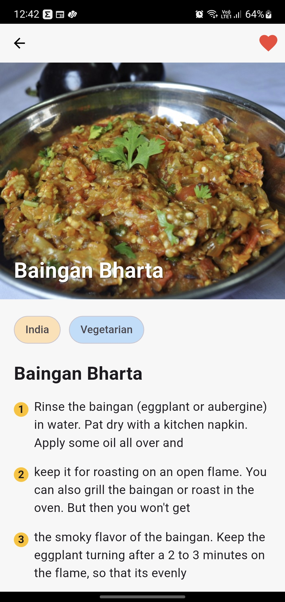
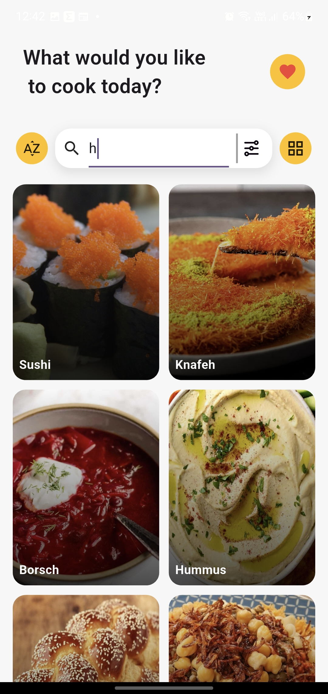
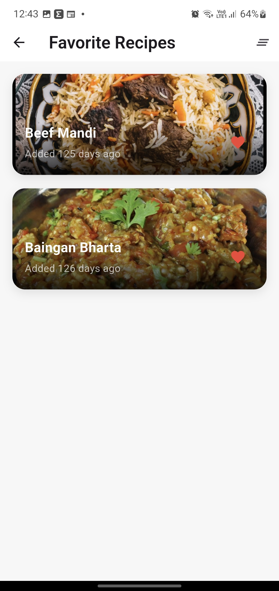

# 🍽️ Recipe Finder App (Flutter)

A modern **Flutter-based Recipe Finder application** that allows users to explore delicious recipes from around the world. Users can search recipes, filter them by category and region, and view detailed cooking instructions with ingredients.

---

## 🚀 Features

- 🔍 **Search Recipes** by name
- 🗂️ **Filter Recipes** by:
  - Category (e.g., Dessert, Seafood, Veg, etc.)
  - Area / Cuisine (e.g., Indian, Italian, American)
- 📖 **Detailed Recipe View**:
  - Ingredients list
  - Cooking instructions
  - Recipe image
- 🎨 Clean & user-friendly UI
- ⚡ Fast API-based data fetching

---
## 📸 Screenshots

| Home Screen | Recipe Details |
|-------------|-----------------|
|  |  |

| Search Screen | Favorites Screen |
|---------------|------------------|
|  |  |

## 🛠️ Tech Stack

- **Flutter**
- **Dart**
- **REST APIs**
- **State Management** (BLoC / Provider – based on implementation)
- **HTTP Package**

---

## 📱 APK Download

You can download and install the APK from the links below:

### 🔹 Google Drive (Recommended)
👉 [Download APK from Google Drive](https://drive.google.com/file/d/1Qc6HnkTzcm6se475XRoA5yvT-UvP9ux9/view?usp=share_link)

### 🔹 GitHub Repository
- The APK file is also uploaded directly inside this repository.

> ⚠️ Make sure to enable **“Install from unknown sources”** on your Android device before installing.

---

## 📂 Project Structure

- `lib/` → Application source code  
- `assets/` → Images, icons, SVGs  
- `apk/` (or root) → Compiled APK file  

---

## 📸 Screenshots

_Add screenshots here (optional)_

---

## 🧑‍💻 Developed By

**Abhay Kumar Dubey**  
Flutter Developer  

---

## 📄 License

This project is for learning and demonstration purposes.
